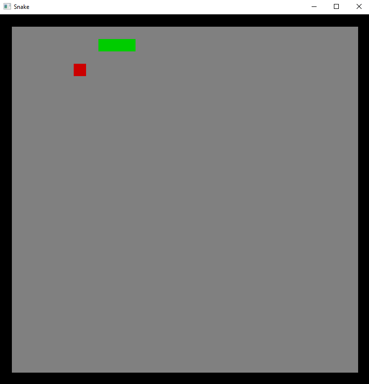

# Snake Game

This is a toy project: game of snake, built in Rust, following the instructions of [Tensor Programming](https://youtu.be/DnT_7M7L7vo).

How to start the game:

* Install Rust
* Copy this repository
* `cd` into repository
* `cargo run`

Window should open, where you can play Snake game.

Remarks:

* Speed of a snake can be changed in `src/game.rs`, `MOVING_PERIOD`. Lower value = faster snake.
* Default of a snake is regulated by `SNAKE_DEFAULT_LEN` in `src/snake.rs`.